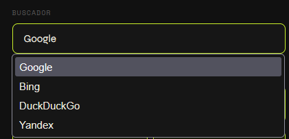
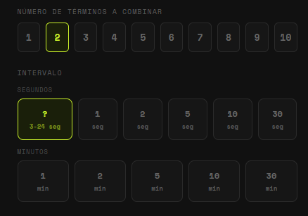

# 🔍 Random Search — Firefox Extension

A Firefox extension that automatically performs random searches at configurable intervals, pulling terms from multiple sources: Wikipedia, Google Trends, iTunes Charts, a built-in word list, or your own custom list.

---

## ✨ Features

- **One-click toggle** — click the toolbar icon to activate or deactivate
- **9 languages** — Spanish, English, French, German, Portuguese, Italian, Chinese, Russian, or All
- **4 search engines** — Google, Bing, DuckDuckGo, Yandex
- **5 search sources** with random rotation:
  - 📖 Wikipedia (random articles via official API)
  - 📈 Google Trends (trending topics via RSS)
  - 🎵 iTunes Charts (top songs)
  - 🎲 Random words (built-in multilingual list)
  - ✏️ Custom list (your own words, one per line)
- **Flexible intervals** — random 3–24 seconds (default), or fixed: 1, 2, 5, 10, 30 seconds / 1, 2, 5, 10, 30 minutes
- **1–10 terms per search** — combine multiple terms from different sources in a single query
- **Auto-close tab** — optionally close the previous tab when a new search opens
- **Visual icon states** — yellow (active) / grey (inactive)
- **Right-click menu** — quick access to settings and instant search

---

## 📸 Screenshots






---

## 🚀 Installation

### Temporary install (development)

1. Download or clone this repository
2. Open Firefox and go to `about:debugging`
3. Click **This Firefox**
4. Click **Load Temporary Add-on**
5. Select the `manifest.json` file from the extension folder

### From Mozilla Add-ons (AMO)

> *(Link will be added once published)*

---

## ⚙️ Configuration

Right-click the toolbar icon and select **⚙ Configuration** to open the settings page. From there you can configure:

| Setting | Options |
|---|---|
| Language | ES / EN / FR / DE / PT / IT / ZH / RU / All |
| Search engine | Google / Bing / DuckDuckGo / Yandex |
| Sources | Wikipedia, Google Trends, iTunes, Random words, Custom list |
| Terms per search | 1 – 10 |
| Interval | Random 3–24s (default), or fixed value |
| Auto-close tab | On / Off |

---

## 🗂️ Project Structure

```
random-search/
├── manifest.json          # Extension manifest (Manifest V2)
├── background.js          # Core logic: search engine, timers, APIs
├── settings.html          # Configuration page (UI)
├── settings.js            # Configuration page (logic)
├── icon.png               # Default icon
├── icon_active.png        # Icon when extension is active (yellow)
├── icon_inactive.png      # Icon when extension is inactive (grey)
└── README.md
```

---

## 🔌 APIs Used

| Source | API | Auth required |
|---|---|---|
| Wikipedia | `wikipedia.org/api/rest_v1/page/random/summary` | No |
| Google Trends | RSS feed via `api.rss2json.com` | No |
| iTunes Charts | `itunes.apple.com/{country}/rss/topsongs` | No |

All APIs are free and require no API key.

---

## 🌐 Browser Compatibility

| Browser | Status |
|---|---|
| Firefox (desktop) | ✅ Fully supported |
| Firefox (Android) | ✅ Compatible (minor manifest change needed) |
| Chrome / Edge / Brave | ✅ See [chrome branch](../../tree/chrome) |

> A separate Chrome-compatible version (Manifest V3 + browser polyfill) is available in the `chrome` branch.

---

## 🛠️ Development

### Prerequisites
- Any modern browser with extension developer tools
- No build tools required — plain HTML, CSS and JavaScript

### Making changes
1. Edit the source files
2. Go to `about:debugging` → **This Firefox** → **Reload** the extension
3. Changes are reflected immediately (no reinstall needed)

### Adding a new language
1. Add a new word array to `RANDOM_WORDS` in `background.js`
2. Add the language code to `WIKI_LANG`, `TRENDS_GEO`, `TRENDS_HL` and `ITUNES_CC`
3. Add a button to the language selector in `settings.html`

### Adding a new search engine
1. Add the search URL to the `ENGINES` object in `background.js`
2. Add an `<option>` to the `#engine` select in `settings.html`

---

## 📄 License

MIT License — see [LICENSE](LICENSE) for details.

---

## 🤝 Contributing

Contributions are welcome! Feel free to:

- Open an **Issue** to report bugs or suggest features
- Submit a **Pull Request** with improvements
- Fork the project and build your own version

---

## 📬 Contact

> *(Add your contact details or GitHub profile here)*
